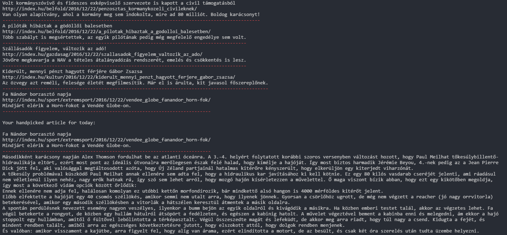

# Winter break's optional clean code challenge

Make the script *as clean as possible* while the output stays the same!

## Sample output

[img/sample-output.png](img/sample-output.png)

## Dependencies

### Canvas

In the OOP 2nd SI week, there is a `pip` (re)install page as Python tooling. Please do it first to have a clean `pip` installation on your computer.

### feedparser  

Install this [RSS parser](https://pythonhosted.org/feedparser/) module with pip:

`pip install feedparser`

### bs4 (Beautiful Soup)

Install this [HTML parser](https://www.crummy.com/software/BeautifulSoup/bs4/doc/) module with pip:

`pip install beautifulsoup4`

